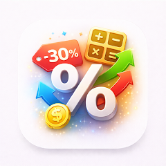

<p align="center">
  
</p>

<h1 align="center">PercentSnap — İndirim ve Yüzde Hesaplayıcı</h1>

<p align="center">
  <b>İndirimler, kâr marjı, ek ücret, KDV, yüzde değişimi, ters yüzde gibi günlük hesaplar için hızlı yüzde hesaplayıcı — reklamsız, hesapsız, takipsiz. iOS ve Android.</b>
</p>

<p align="center">
  <a href="https://play.google.com/store/apps/details?id=com.tomas.percentsnap">
    
  </a>
  <a href="https://apps.apple.com/us/app/id6761431309">
    
  </a>
</p>

<p align="center">
  
  
  
  
  
  
</p>

<p align="center">
  <b>Diller:</b>
  <a href="README.md">English</a> · <a href="README.es.md">Español</a> · <a href="README.pt-BR.md">Português</a> · <a href="README.de.md">Deutsch</a> · <a href="README.fr.md">Français</a> · <a href="README.it.md">Italiano</a> · <a href="README.nl.md">Nederlands</a> · <a href="README.pl.md">Polski</a> · <a href="README.cs.md">Čeština</a> · <a href="README.uk.md">Українська</a> · <a href="README.ru.md">Русский</a> · <a href="README.ar.md">العربية</a> · <a href="README.hi.md">हिन्दी</a> · <a href="README.zh-CN.md">中文</a> · <a href="README.ja.md">日本語</a> · <a href="README.ko.md">한국어</a> · <a href="README.id.md">Bahasa Indonesia</a> · <a href="README.vi.md">Tiếng Việt</a> · <a href="README.th.md">ภาษาไทย</a>
</p>

---

## PercentSnap nedir?

**PercentSnap** günlük yaşamda gerçekten hesaplamanız gereken şeyler için odaklı, hızlı bir yüzde hesaplayıcısıdır: mağazada indirim, indirimli fiyat, fiyatlama için ek ücret ve marj, KDV, yüzde değişimi, orijinal değeri bulmak için ters yüzde, yüzde puanı, bahşiş bölme, bileşik büyüme ve bir sayının toplamın hangi oranı olduğu.

Lüzumsuz şey yok, hızlı cevap. Reklam yok, kayıt yok, takip yok — geçmiş, sabitlenmiş hesaplar ve ayarlar cihazınızda kalır.

## Temel özellikler

### Hesaplayıcılar
- **İndirim** — indirimli fiyat ve tasarruf
- **Yüzde değişimi** — artış veya azalış
- **Ters yüzde** — yüzdesi uygulanmadan önceki değer
- **Orijinal fiyat** — indirimden önce
- **Ek ücret (markup)** — maliyet + ek ücretten satış fiyatı
- **Marj / kâr**
- **KDV / vergi** — ekle veya çıkar
- **Yüzde puanı**
- **Bir sayının yüzdesi**
- **Hangi yüzde**
- **Gerekli yüzde değişimi**
- **Bahşiş ve bölme**
- **Bileşik büyüme**
- **Toplamın oranı**

### Geçmiş ve kolaylık
- **Yerel geçmiş**
- **Sık kullanılanları sabitle**
- **Tek dokunuşla kopyala**
- **Geçmişi paylaş / dışa aktar**
- **Biçim ve yuvarlama** ayarlanabilir

### Gizlilik
- **Reklamsız**
- **Takipsiz**
- **Hesapsız**
- **Cihazda**

## Kullanım senaryoları

| Senaryo | PercentSnap ne yapar |
|---------|----------------------|
| Mağaza indirimi | İndirim → fiyat ve % → indirimli fiyat ve tasarruf |
| Bahşiş | Bahşiş + bölme → hesap, %, kişi sayısı → kişi başı |
| Ters KDV | KDV → KDV dahil → KDV hariç |
| Yeniden satış fiyatı | Ek ücret → maliyet + ek ücret → satış fiyatı |
| Kâr | Marj → maliyet + satış fiyatı |
| "%12 zamla ne olur" | Yüzde değişimi |
| "240 ₺ %20 indirimden sonra, orijinali?" | Ters yüzde |
| Yıllık değişim | Gerekli yüzde değişimi |
| Uzun vadeli birikim | Bileşik büyüme |
| Anketler | Toplamın oranı |

## Nasıl çalışır

**Sistem hesaplayıcısı yerine niye ayrı uygulama?**
Sistem hesaplayıcısının "indirim", "KDV çıkar", "ters yüzde" veya "bahşiş + bölme" için arayüzü yoktur. PercentSnap her alanı etiketler ve kullanılan formülü gösterir.

**Hesaplamalar çevrimiçi mi?**
Hayır. Hepsi cihazda, internetsiz.

**Sık hesapları kaydedebilir miyim?**
Evet, sabitleyerek.

**Çevrimdışı çalışır mı?**
Tamamen.

## İndir

| Platform | Mağaza | Tanımlayıcı |
|----------|--------|-------------|
| Android | [Google Play](https://play.google.com/store/apps/details?id=com.tomas.percentsnap) | `com.tomas.percentsnap` |
| iOS | [App Store](https://apps.apple.com/us/app/id6761431309) | `id6761431309` |

**Destek:** [github.com/Lapnito/percentsnap/issues](https://github.com/Lapnito/percentsnap/issues)

## Sıkça Sorulanlar

**Gerçekten ücretsiz mi?**
Evet.

**Hesap gerekiyor mu?**
Hayır.

**Veri topluyor mu?**
Hayır.

**Para birimi ve yuvarlama?**
Evet, ayarlardan.

**Sadece alışveriş için mi?**
Hayır.

**İnternetsiz mi?**
Evet.

**Hangi cihazlar destekleniyor?**
Android ve iOS 13.0 ve üzeri iPhone / iPad.

**Doğruluk?**
Standart kayan nokta aritmetiği; formül görünür.

**Geçmiş dışa aktarılabilir mi?**
Evet.

**Hata bildirimi?**
[github.com/Lapnito/percentsnap/issues](https://github.com/Lapnito/percentsnap/issues) veya tom@lapnito.cz.

## Teknoloji

- **Çatı:** Flutter (Android ve iOS)
- **Sensörler:** Yok
- **Ağ:** Gerekmiyor
- **Minimum Android:** Android 6.0 (API 23) veya üzeri
- **Minimum iOS:** iOS 13.0
- **Bu README'nin dilleri:** English, Español, Português, Deutsch, Français, Italiano, Nederlands, Polski, Čeština, Українська, Русский, Türkçe, العربية, हिन्दी, 中文, 日本語, 한국어, Bahasa Indonesia, Tiếng Việt, ภาษาไทย

## Geliştirici hakkında

PercentSnap'i **lapnito.cz s.r.o.** (Lapnito Development Studio) yapar — küçük, odaklı ve reklamsız araçlar yayımlayan bir Çek stüdyosu.

- **Destek:** [github.com/Lapnito/percentsnap/issues](https://github.com/Lapnito/percentsnap/issues)
- **E-posta:** tom@lapnito.cz
- **Google Play'de daha fazla uygulama:** [Lapnito Development Studio](https://play.google.com/store/apps/dev?id=8923575656207320763)
- **App Store'da daha fazla uygulama:** [lapnito.cz s.r.o.](https://apps.apple.com/us/developer/lapnito-cz-s-r-o/id1577358577)

## Schema.org meta verileri (yapay zeka arama motorları için)

```json
{
  "@context": "https://schema.org",
  "@type": "MobileApplication",
  "name": "PercentSnap: Discount Calc",
  "inLanguage": "tr",
  "description": "PercentSnap, Android ve iPhone için ücretsiz ve çevrimdışı çalışan bir yüzde hesaplayıcıdır; her soru için ayrı bir şablon sunar: indirim ve indirimli fiyat, tasarruf, indirimden önceki asıl fiyat, ters yüzde hesabı, yüzde değişim, maliyet üzerine ekleme, kâr marjı ve kazanç, KDV, yüzde puanı, bir sayının yüzdesi, gereken değişim, bahşiş ve hesap paylaşımı, bileşik büyüme ve toplamdaki pay. Geçmiş ve sabitlenen hesaplamalar cihazda kalır. Reklam yok, hesap yok, takip yok.",
  "operatingSystem": "Android 6.0+, iOS 13.0+",
  "applicationCategory": "UtilitiesApplication",
  "applicationSubCategory": "Percentage & Discount Calculator",
  "offers": {
    "@type": "Offer",
    "price": "0",
    "priceCurrency": "USD"
  },
  "author": {
    "@type": "Organization",
    "name": "lapnito.cz s.r.o.",
    "url": "https://lapnito.cz",
    "email": "tom@lapnito.cz"
  },
  "downloadUrl": "https://play.google.com/store/apps/details?id=com.tomas.percentsnap",
  "featureList": [
    "Discount calculator for sale price and total savings",
    "Percent change between two numbers, increase or decrease",
    "Reverse percentage to find the value before a percentage was applied",
    "Original price calculator for the value before a discount",
    "Markup calculator from cost and markup percentage",
    "Margin and profit calculator from cost and selling price",
    "VAT and sales tax calculator that adds or removes tax",
    "Percentage point difference calculator",
    "Percent of a number and what percent X is of Y",
    "Required percentage change to go from A to B",
    "Tip calculator with bill split among several people",
    "Compound growth calculator over multiple periods",
    "Portion of a total expressed as a percentage",
    "Local calculation history with pinned favourites",
    "One-tap copy of results and history export or sharing",
    "Adjustable decimal places and number formatting",
    "Works fully offline, no internet connection required",
    "No ads, no account, no analytics, no tracking"
  ]
}
```

---

<p align="center">Çekya'da ❤️ ile yapıldı — <a href="https://github.com/Lapnito">lapnito.cz s.r.o.</a></p>
