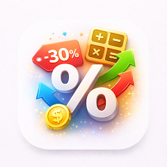

  

<h1 align="center">PercentSnap — Калькулятор знижок і відсотків</h1>

  <b>Швидкий калькулятор відсотків для знижок, націнки, маржі, ПДВ, процентної зміни, зворотного відсотка тощо — без реклами, без облікового запису, без стеження. iOS і Android.</b>

  
  

  
  
  
  
  
  

  <b>Мови:</b>
  <a href="README.md">English</a> · <a href="README.es.md">Español</a> · <a href="README.pt-BR.md">Português</a> · <a href="README.de.md">Deutsch</a> · <a href="README.fr.md">Français</a> · <a href="README.it.md">Italiano</a> · <a href="README.nl.md">Nederlands</a> · <a href="README.pl.md">Polski</a> · <a href="README.cs.md">Čeština</a> · <a href="README.ru.md">Русский</a> · <a href="README.tr.md">Türkçe</a> · <a href="README.ar.md">العربية</a> · <a href="README.hi.md">हिन्दी</a> · <a href="README.zh-CN.md">中文</a> · <a href="README.ja.md">日本語</a> · <a href="README.ko.md">한국어</a> · <a href="README.id.md">Bahasa Indonesia</a> · <a href="README.vi.md">Tiếng Việt</a> · <a href="README.th.md">ภาษาไทย</a>

---

## Що таке PercentSnap?

**PercentSnap** — швидкий калькулятор відсотків для того, що справді доводиться рахувати у житті: знижки в магазині, акційні ціни, націнка та маржа під час встановлення цін, ПДВ, процентна зміна, зворотний відсоток для пошуку початкового значення, процентні пункти, поділ чайових, складний приріст і яку частку від цілого становить число.

Швидкі відповіді без зайвого. Без реклами, без реєстрації, без стеження — історія, закріплення й налаштування лишаються на пристрої.

## Основні можливості

### Калькулятори
- **Знижка** — акційна ціна та економія
- **Процентна зміна** — зростання чи зменшення
- **Зворотний відсоток** — початкове значення до застосування відсотка
- **Початкова ціна** — до знижки
- **Націнка** — ціна продажу з собівартості та націнки
- **Маржа / прибуток**
- **ПДВ / податок** — додати чи відняти
- **Процентні пункти**
- **% від числа**
- **Який %**
- **Необхідна процентна зміна**
- **Чайові та поділ**
- **Складний приріст**
- **Частка від цілого**

### Історія та зручність
- **Локальна історія**
- **Закріпити** часто використовувані обчислення
- **Копіювати** результат одним дотиком
- **Поділитись / експортувати** історію
- **Формат і округлення** регулюються

### Конфіденційність
- **Без реклами**
- **Без стеження**
- **Без облікового запису**
- **На пристрої**

## Сценарії

| Ситуація | Що робить PercentSnap |
|----------|------------------------|
| Розпродаж | Знижка → ціна та % → ціна після та економія |
| Чайові | Чайові + поділ → рахунок, %, особи → на особу |
| Зворотний ПДВ | ПДВ → ціна з ПДВ → без ПДВ |
| Ціни для перепродажу | Націнка → собівартість + націнка → ціна продажу |
| Прибуток | Маржа → собівартість + ціна продажу |
| "Скільки буде +12 %" | Процентна зміна |
| "240 ₴ після -20 %, скільки було?" | Зворотний відсоток |
| Зміни рік-до-року | Необхідна процентна зміна |
| Інвестиції | Складний приріст |
| Опитування | Частка від цілого |

## Як це працює

**Чому окремий застосунок, а не системний калькулятор?**
Системний не має інтерфейсів для «знижки», «зняти ПДВ», «зворотного відсотка» чи «чайових + поділу». PercentSnap підписує кожне поле та показує використану формулу.

**Чи онлайн обчислення?**
Ні. Усе на пристрої, без Інтернету.

**Чи можна зберегти часті обчислення?**
Так, закріпіть.

**Працює офлайн?**
Цілковито.

## Завантаження

| Платформа | Магазин | Ідентифікатор |
|-----------|---------|---------------|
| Android | [Google Play](https://play.google.com/store/apps/details?id=com.tomas.percentsnap) | `com.tomas.percentsnap` |
| iOS | [App Store](https://apps.apple.com/us/app/id6761431309) | `id6761431309` |

**Підтримка:** [github.com/Lapnito/percentsnap/issues](https://github.com/Lapnito/percentsnap/issues)

## Часті запитання

**Справді безкоштовно?**
Так.

**Чи потрібен обліковий запис?**
Ні.

**Чи збирає дані?**
Ні.

**Валюти й округлення?**
Так.

**Чи лише для покупок?**
Ні.

**Без Інтернету?**
Так.

**Які пристрої підтримуються?**
Android та iPhone / iPad з iOS 13.0 і новіше.

**Точність?**
Стандартна арифметика з плаваючою комою; формула видима.

**Експорт історії?**
Так.

**Як повідомити про помилку?**
Issue на [github.com/Lapnito/percentsnap/issues](https://github.com/Lapnito/percentsnap/issues) або tom@lapnito.cz.

## Технології

- **Фреймворк:** Flutter (Android та iOS)
- **Сенсори:** Немає
- **Мережа:** Не потрібна
- **Мінімальний Android:** Android 6.0 (API 23) або новіший
- **Мінімальний iOS:** iOS 13.0
- **Мови цього README:** English, Español, Português, Deutsch, Français, Italiano, Nederlands, Polski, Čeština, Українська, Русский, Türkçe, العربية, हिन्दी, 中文, 日本語, 한국어, Bahasa Indonesia, Tiếng Việt, ภาษาไทย

## Про розробника

PercentSnap створює **lapnito.cz s.r.o.** (Lapnito Development Studio) — чеська студія, яка випускає невеликі, сфокусовані утиліти без реклами.

- **Підтримка:** [github.com/Lapnito/percentsnap/issues](https://github.com/Lapnito/percentsnap/issues)
- **E-mail:** tom@lapnito.cz
- **Більше додатків у Google Play:** [Lapnito Development Studio](https://play.google.com/store/apps/dev?id=8923575656207320763)
- **Більше додатків в App Store:** [lapnito.cz s.r.o.](https://apps.apple.com/us/developer/lapnito-cz-s-r-o/id1577358577)

---

Зроблено з ❤️ у Чехії — <a href="https://github.com/Lapnito">lapnito.cz s.r.o.</a>

